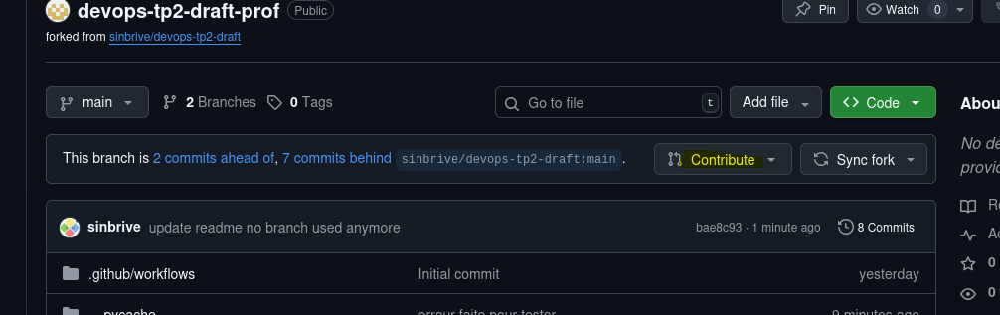
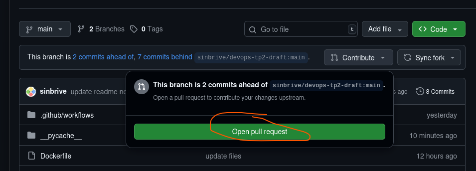
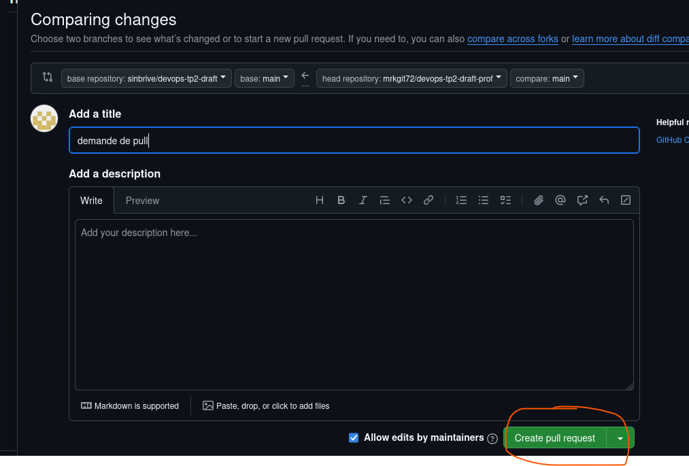

# FICHE – CI DEVOPS 

## Cycle DevOps (simplifié)
1. Développer une fonctionnalité 
2. Écrire un test unitaire 
3. Pousser le code et ouvrir une Pull Request 
4. CI GitHub Actions valide ou bloque ✅❌
5. Le code validé peut être intégré 

---

## Commandes de base Git

### Config initiale (à faire UNE seule fois)
```
git config --global user.name "VotreNom"
git config --global user.email "vous@example.com"
```

### Login SSH
- voir si vous avez déjà un .pub dans ~/.ssh/ sinon:
- générer la clé 
  ```
  ssh-keygen -t ~/.ssh/id_rsa_github -C "exampe@gmail.com"
  ```

- copier la clé 
   - `cat ~/.ssh/id_rsa_github.pub`
   - copier
- dans votre compte Github: 
   - profil -> setting -> ssh -> coller

### "Forker" le repository (dépôt) de base du formateur (ce repo)
- en haut à droite, bouton "Fork"
- vous avez doénavant une copie de ce repo

### Workflow classique

#### Clonez votre fork en local
```
git clone https://github.com/<user>/nom-du-repo.git

cd nom-du-repo
```

#### Créez une nouvelle branche
```
git checkout -b feature-nouvelle-route
```

#### (codez votre feature...)

#### Vérifiez l’état et ajoutez vos modifications
```
git status

git add .
```

#### Enregistrez un commit
```
git commit -m "Ajout route /hello/<name>"
```

#### Téléverser vos changements
```
git push origin feature-nouvelle-route
```


➡️ Ensuite, ouvrez une **Pull Request** vers le dépôt formateur.

---


---


---


---

## Commandes Python utiles

### Installer dépendances
```
pip install -r requirements.txt
```

### Lancer l’application Flask
```
python app.py
```

### Lancer les tests
```
pytest -v
```

➡️ Tous les tests doivent être verts ✅ !

---

## Qualité du code (niveau avancé)
```
flake8 app.py tests/
```
➡️ Corrigez les erreurs signalées avant de pousser votre code.

---

## Workflow PR + CI/CD

1. Développez une feature sur une BRANCHE.  
2. Commitez → pushez → ouvrez une Pull Request.  
3. **GitHub Actions** exécute automatiquement :  
   - flake8 → qualité du code  
   - pytest → tests unitaires  
4. La PR ne peut être fusionnée que si tout est vert ✅.  

---

## Bonnes pratiques
- Toujours créer une **branche** avant de coder !  
- Toujours lancer `pytest` en local avant de pousser.  
- Un commit = une étape claire (message explicite).  

